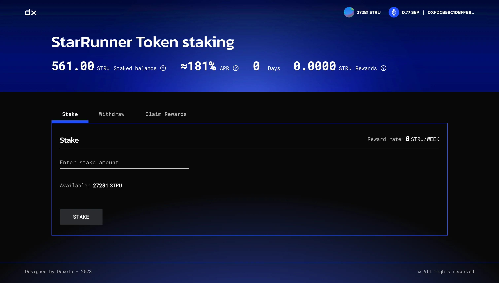

**Мова: [Українська](README.md), [English](README.en.md).**

## Зовнішній вигляд

## Опис проекту

Децентралізований веб-додаток з взаємодію з різними контрактами, у мережі Ethereum.

## Реалізовано

1. Односторінковий децентралізований веб-додаток.
2. Підключення до свого гаманця в мережі Ethereum.
3. Візуалізація балансу акаунту, адреси гаманця, процентної ставки, період розподілу та кількість винагород.
4. Розрахунок ставки та кількості винагород.
5. Додавання, виведення(по кількості або зразу всі) з/до стейкінгу токенів, виведення винагород.
6. Оповіщення користувача о вдалих чи помилкових операціях з токенами.

## Стек технологій:

## Інструкція з використання

Для роботи з гаманцем потрібно встановити [MetaMask](https://metamask.io/) - це розширення для веб-браузера, що дозволяє
користувачам зручно управляти своїми криптовалютними активами та взаємодіяти з децентралізованими додатками (DApps) на
блокчейні Ethereum. Воно дозволяє створювати та керувати гаманцями, підписувати транзакції та здійснювати різноманітні
дії на блокчейні.

1. Встановити розширення MetaMask у своєму веб-браузері (наприклад, Google Chrome, Mozilla Firefox) або завантажити
   офіційний додаток MetaMask з магазину додатків свого пристрою (App Store для iOS або Google Play Store для Android).
2. Після встановлення розширення або додатку, треба створити новий гаманець або відновити наявний за допомогою своїх
   мнемонічних слів (seed phrase).
3. Для тестування додатку не обхідно мати на рахунку токени Sepolia для розрахування за комісію по операціям, а також
   токени SR для проведення самих операцій.

   Токени Sepolia для оплати комісій можна отримати з цих кранів:

   - [Кран №1](https://sepoliafaucet.com/)
   - [Кран №2](https://sepolia-faucet.pk910.de/)
   - [Кран №3](https://access.rockx.com/faucet-sepolia)

   Токени SR для проведення операцій за
   [посиланням](https://sepolia.etherscan.io/address/0x59Ec26901B19fDE7a96f6f7f328f12d8f682CB83#writeContract).

   Обрати метод mint, порядковий номер 4. Потрібно підключитися до сканера і натиснути кнопку "write", і підтвердити
   транзакцію в гаманці, по результату на гаманець який зробив виклик буде надіслано 1000 токенів StarRunner.

   \*\*Щоб побачити токени в гаманці MetaMask, треба токени SR вручну імпортувати вказавши адресу контракту
   "0x2F112ED8A96327747565f4d4b4615be8fb89459d".

4. Завершивши ці кроки, підключити свій гаманець до веб-додатку, натиснувши кнопку "Connect wallet".
5. Після вдалого підключення гаманця замість "Connect wallet" з'явиться інформація о адресі та баланс токенів.
6. Інформаційний блок:

   - Stake balance - поточний баланс стейкінгу;
   - APR - процентна ставка винагород;
   - Days - період розподілу винагород;
   - Rewards - поточний розмір винагород;

7. Вкладення Stake - покласти на баланс стейкінгу токени.

   Reward rate - показує кількість винагород за тиждень. Available - доступна кількість токенів на балансі.

8. Вкладення Withdraw - вивести задану кількість токенів(Withdraw) та вивести всі токени зі стейкінгу та забрати всі
   винагороди (withdraw all & Claim rewards). Available - доступна кількість токенів на стейкінгу.

   \*\*withdraw all & Claim rewards - тільки для десктопної версії.

9. Вкладення Claim rewards - вивести доступні винагороди на гаманець. Available - доступна кількість винагород.

## Посилання на веб-додаток:

[Посилання на веб-додаток](https://dexola-camp-part2.vercel.app/)

## Тестове завдання:

[Тестове завдання](https://docs.google.com/document/d/1u2mTxMp7gvY18pqrmpl5kEVDMDOkDtNyVk8uAOHozbE/edit#heading=h.q55m2wxvgm01)
